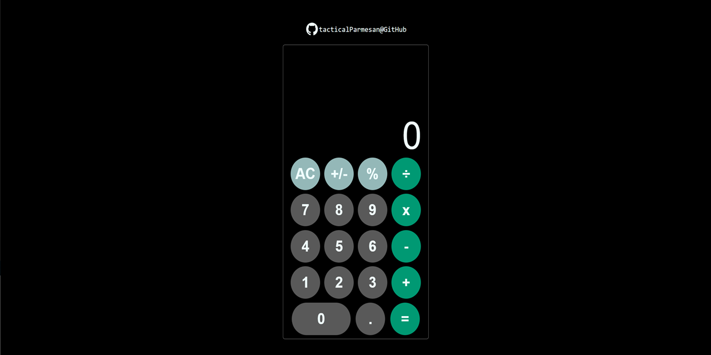

# EddyCalc

## Introduction 

I built EddyCalc while doing the Odin Project "Calculator" assignment. The exercise asked for building a calculator and give it some styling: I decide to "clone" the iOS calculator and to give to it a little of my personal touch.

## Features

EddyCalc sports the modern, simplistic (but sleak) design of the iOs calculator. It performs all the basic arithmetic operations, changes the sign of the displayed number, converts it in percentage format. But there some little nice features I added myself by banging my head against the screen:

* __Basic responsiveness__: Every dimensional value is stored ad a percentage of viewport (vh), ensuring that the calculator will have the same proportions on different devices and windows.
* __Visual feedback__: When the user hovers on a button, it gets highlighted, and when there is an operation selected, the button changes look mimicking what happens in the iOS calculator.
* __Overflow Prevention__: The calculator display will always show a maximum of nine digits and the size of the displayed value varies according to the number of digits present, again reproducing what happens on iOS.
* __Keyboard support__: The calculator can be used entirely with clicks on pressing numbers, operators, period and Enter on the keyboard. With keyoard is also possiible to delete the last number of the number shown by pressing Backspace.
* __Floating point numbers and scientific notation__: pretty self explanatory.

## Closing notes

This has been the most difficult project since the beginning of the Odin Project, it took me a week to perfect it and to make it functional and sufficiently responsive. As always, It's been a great learning opportunity that gave me a chance to perfect the foundational skills in this development journey.